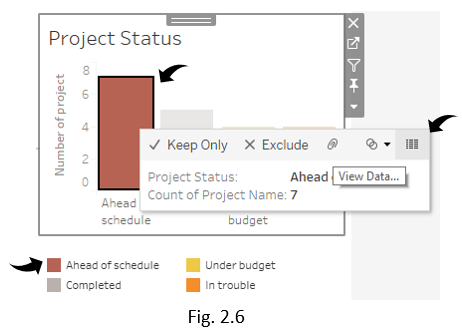

## _EXERCISE_

This is a prototype dashboard for a BI system to support Project Management Office for a large government organisation. The dashboard is designed to provide a snapshot of the status of all of these projects each day and provides a quick overview of how each project  tracking against its budget and expected timeline. 

The dashboard projects a view of projects that are in trouble, and which are ahead of schedule/under budget. For completed projects, client satisfaction levels compared to her KPI of 90% of projects with a ‘good’ or higher satisfaction rating.

The dashboard also provides levels of staff required looking forward over the next three months, and how that compares to the expected number of staff available in that timeframe which takes into account existing projects, as well as projects that will commence within the three-month period. 

Fig1.1

## INTRODUCTION
The course of the dashboard prototype as shown in Fig1.1 will be discussed In two parts in the following section. The first section describes the functional purpose of dashboard and its composition and the second section describes the BI (Business Intelligence) interface desgin guidelines and heuristics. 

### 1.	Purpose of dashboard

The dashboard as shown in Fig1.1 gives a high level overview which takes into account the current and projects that commence within three months. The overview takes into consideration the allocated and budgeted costs, current status and customer satisfaction aspects of the projects. The dashboard consists of the following components as discussed below: 

#### 1.1	Budget over estimate

This component of the dashboard uses side-by-side bar graph to show the allocated and budgeted cost for invidual projects allocated till date. The unit for the budgeted costs is taken ‘in thousands’ as displayed on the y-axis, while the project names can be seen along x-axis, on top of the graph. The comparison between the allocated and budget costs can be seen as the difference in the height of the bar adjacent for each project respectively. The legend of this component graph differentiates allocated and budgeted cost based on the color indicated respectively. 

#### 1.2	Project status 

This component of the dashboard uses bar graph to display number of projects grouped by status indicated by color schema in the legend. The graph shows four distinct status: completed, in trouble, under budget and ahead of schedule respectively. The graph indicates the number of projects which share the same progress or status till date. The status is plotted on x-axis while the number of projects can be seen along the y-ais respectively. 

#### 1.3	Staff by Quarter 

This component of the dashboard uses bar graph to display number of staff for each project existing and that commence in next quarter (Q4) respectively. The number of staff is plotted over x-axis while the y-axis includes the project names of both existing and Q4. The comparison of staff for existing and Q4 can be seen as the difference in the hieght of the bar respectively. The color schema in the legend helps in differentiate the existing versus Q4 projects respectively. 

#### 1.4	Total Staff by Quarter

This component of the dashboard uses histogram to display total number of staff for all the projects till date versus projects commencing in Q4. The constant line values over each bar indicate the number of staff for existing and projects that commence in Q4 and the constant line passing through the center of the graph indicates the difference in the staff for existing and Q4 projects. This graph shares common legend with ‘staff by quarter’. The number of staff is indicated iver x-axis while y-axis indicates the period.

#### 1.5	Customer Satisfaction

This component of the dashboard uses histogram to represent the customer satisfaction achieved for existing projects overall. The measure of customer satisfaction is taken as a percentage plotted on y-axis while the satisfaction levels; satisfied and very satisfied are plotted on x-axis. The color schema in the legend differentiates the two satisfaction levels from each other.

### 2.	Design of Dashboard

The dashboard shown will allow  the director of PMO, Tania to present the key business facts to support effective decision making and the design of dashboard consists of parameters relevant to the performance of the 30 IT projects. To evaluate the design of the dashboard shown in Fig1.1. this section focuses on two main dashboard techniques: design and usability respectively as discussed below.

### 2.1	Design techniques: 

The dashboard shown in fig X takes the form of a ‘strategic’ dashboard as it shows the health of the current projects based on customer satisfaction ratings shown in the bottom right corner, progress of projects based on the current status is shown on the top right corner and measure of allocated and budgeted costs and staffing for given projects as shown in the left part of dashboard.

#### 2.1.1	Graphs

The dashboard uses two types of graph side-by-side used in ‘Budget over Estimated’ component of the graph and the normal bar charts for the remaining components of the dashboard. The comparison for the allocated and the budgeted costs can be  seen as the difference in the height of the bar adjacent to each other for individual project (AMC Wire) as shown below: 

#### 2.1.2	Navigation Methods

The navigation in the dashboard is used to explore the data within the report, to view more data than currently displayed in the dashboard. The Fig2.1 indicates the control menu using which the graph can be further explored to get more detailed information. The view can be controlled by down arrow in the control menu and other following tasks that can be performed by the contol menu as shown in Fig2.2 are: 

*	Filter data 
* Drill down and up to see lower or higher levels of detail
*	Legend control 
*	View low level and high level tabular data

 

_Filter Data:_ The Fig2.3 below shows ‘project status’ component of the dahsboard. This component can filtered based on the month, project status and quarter. 

_Drill down and drill up:_ The Fig2.4 shows that the data in the’Budget over Estimated’ can be further drilled down based on period, for instance first quarter (Q1) among all all quarters and Q1 can be further drilled down based on month of choice (January /February/March).

Similarly, the data can be drilled up based on all quarters (Q1, Q2 and Q3) and all months as shown in the Fig2.5. 

 

_Drill through (Low-level and high-level tabular data):_ The data behind the graphs can be visualized in tabular details such as seen in the Fig2.6, which shows the access to tabular data for projects with ‘Ahead of schedule’ status. The high-level view of tabular data gives the ‘project status’ and ‘count of projects’ as shown in Fig2.7. The Fig 2.8 shows the low-level view of tabular data which contains more details such as month, project manager and so on.

 

### 2.2	Usability Techniques: 

The course of the section uses Nielsen’s 10 heuristics based on principles of discoverability (Norman, 2013) to evaluate the interaction design of the dashboard shown in Fig1.1 (Nielsen & Molich, 1990). 

#### _1.	Visibility of system status_

* The below Fig2.2.1 shows rectangular frame around the individual component of the dashboard helps user to distuinguish each component of dashboard from another.

* The postion of the horizontal slider suggests user the relative position of slider with respect to the bars in the graph. In this screenshot it shows that there are more values to the right and left of the graph space.

#### _2.	Match between system and real world_

The Fig2.2.1 shows shows some of the terminology and phrases used in the real world such as:

* ahead of schedule, in trouble, completed as project status parameters.
* ‘satisfied’ and ‘very satisfied’ as customer satisfaction parameters.
* ‘in thousand’ for numeric value of cost.
* ‘commences Q4’ and ‘existing’ for quarter.

#### _3.	User control and freedom_

As shown in the Fig2.2.3, the spelling errors can be undone using the cross sign. In this case the spelling error is with month name and the cross sign option will allow the user to re-enter the search word or exit from the unwanted situation of spelling mistakes.

There is more than one way to filter the data; by entering manually the month or checking the choice of quarter, which gives user the control and freedom to select the method of choice to filter the data. 

#### _4.  Consistency and standards_

The figure 2.2.4 shows consistency in terms of: 

* Standardization of color pallete for graphs and the shape(square) of the legend icons 
* Use of familiar icons such as filter icon  to filter data and search icon   to search data.
* Font and font size of the titles for each component of the dashboard
* Use of no grids through out the dashboard
* Consistency in the terminologies such as quarter parameters ‘commences Q4’ and ‘existing’ for both the components of the graph ‘staff by project’ and ‘total staff by quarter’.

#### _5.	Error prevention_

* _Auto-suggestion:_ As discussed in the above Fig2.2.4 the dashboard allows to auto-suggest the month ‘Sep’ for the user. 
* _User confirmation:_ As shown in the Fig2.2.5 the data to ‘keep’ and ‘exlcude’ needs to be confirmed before the action is executed.  

#### _6.	Recognition rather than recall_

As shown in Fig2.2.6 the cognitive load is reduced by summarizing the information as shown in tooltip. The user does not have to collect and process the facts that are in the graph. The summary information on the tooltip reduces the cognitive load. 

#### _7.	Flexibility and efficiency of use_

The user has the fexibility to search the month shown in Fig 2.2.7 or select the month of choice shown in Fig2.2.8, ‘Feb’ in this case. This gives flexibility to use one or more method to filter the data.

 

#### _8.	Aesthetic and minimalist design_

The design of the dashboard uses minimum colors and minimum information, no gridlines in the graphs and use the flat design to keep the design minimalistic. 

#### _9.	Help users recognize, diagnose, and recover from errors_

As shown in the Fig2.2.9 the invalid search specifies clearly the result of the feedback, ‘not found’ in this case. 

#### _10.	Help and documentation_

The dashboard uses tooltips and key indicators for icons to guide user through the dashboard such as the ‘Find value’ for search icon and ‘Click to Show All Values’ filter icon as shown in the Fig2.3.1. 

### _References_
Nielsen, J., & Molich, R. (1990). Heuristic evaluation of user interfaces. Paper presented at the Proceedings of the SIGCHI conference on Human factors in computing systems.

Norman, D. A. (2013). The design of everyday things (Revised and expanded edition. ed.). New York: New York Basic Books, a member of the Perseus Books Group.

